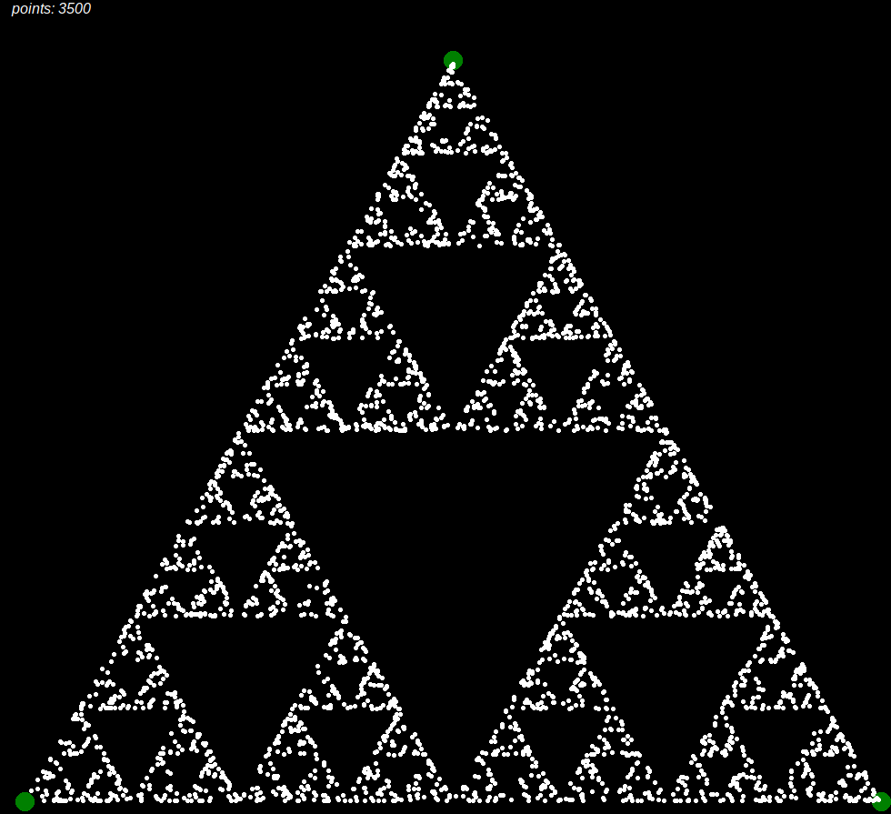

# SIERPINSKI-TRIANGLE
This program simulates the famous Sierpinski Triangle. 
The result will be a fractal with the shape of an equilateral triangle. 
As you increase the number of points, the precision of the smaller internal triangles will increase too.

&nbsp;

# Instructions:
In order for it to operate correctly you need the Python Tkinter library installed. 
On Ubuntu based systems run:
<pre><code>sudo apt install python3-tk</code></pre>
Then *make* the **C** file:
<pre><code>make triangle</code></pre>
And finally run it:
<pre><code>./triangle.out</code></pre>
I marked what parameters you can change inside the **C** and **Python** files. 
It will only affect the final look of the simulation.

&nbsp;

# How does it work?
It starts by calculating the position of its 3 vertices. 
Each point is then found by applying the following algorithm:   
1. randomly select any point inside the triangle and consider that the current position.
1. randomly select any one of the three vertex points.
1. move half the distance from the current position to the selected vertex.
1. draw the point in current position.
1. repeat from step 2.

&nbsp;

# What it looks like: 

